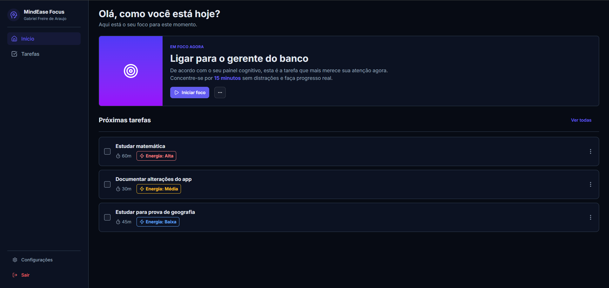

# MindEase Focus

## 🚀 Firebase Setup (Vite + React)

Este projeto utiliza Firebase configurado via variáveis de ambiente usando Vite.



## 📦 1. Criar projeto no Firebase

1. Acesse o [Firebase Console](https://console.firebase.google.com)
2. Crie um novo projeto
3. Vá em **Project Settings → General → Your Apps**
4. Crie um **App Web**
5. Copie as credenciais fornecidas

## 🔐 2. Habilitar Authentication

1. No menu lateral do Firebase Console, vá em **Authentication**
2. Clique em **Get Started**
3. Em **Sign-in method**, habilite o método **Email/Password**

## 🗄️ 3. Habilitar Firestore Database

1. No menu lateral, vá em **Firestore Database**
2. Clique em **Create Database**
3. Escolha **Start in test mode** (para desenvolvimento)
4. Selecione a região recomendada

## 🔒 4. Configurar regras do Firestore

Para garantir que cada usuário só possa acessar seus próprios dados, configure as seguintes regras no **Firestore**.

1. No **Firebase Console**, vá em **Firestore Database**
2. Clique na aba **Rules**
3. Substitua pelas regras abaixo:

```javascript
rules_version = '2';
service cloud.firestore {
  match /databases/{database}/documents {
    
    match /users/{userId} {
      allow read, write: if request.auth != null && request.auth.uid == userId;
    }

    match /tasks/{taskId} {
      allow create: if request.auth != null && request.auth.uid == request.resource.data.userId;
      allow read, update, delete: if request.auth != null && request.auth.uid == resource.data.userId;
    }
  }
}
```

## ⚙️ 5. Criar arquivo .env

Na raiz do projeto crie um arquivo chamado .env:

```env
VITE_FIREBASE_API_KEY=
VITE_FIREBASE_AUTH_DOMAIN=
VITE_FIREBASE_PROJECT_ID=
VITE_FIREBASE_STORAGE_BUCKET=
VITE_FIREBASE_MESSAGING_SENDER_ID=
VITE_FIREBASE_APP_ID=
```

⚠️ Todas variáveis devem começar com VITE_ para serem acessíveis no Vite.

## 6. ▶️ Rodar o projeto

```bash
# instalar dependências
npm install

# iniciar servidor de desenvolvimento
npm run dev
```

Abra no navegador:
http://localhost:5173

## 🏗️ 7. Arquitetura do Projeto

O projeto foi estruturado utilizando **Clean Architecture** com organização **modular por domínio**.

Cada módulo representa uma funcionalidade da aplicação (ex: `auth`, `tasks`) e possui suas próprias camadas, permitindo isolamento de responsabilidades e melhor escalabilidade do sistema.

### Camadas da arquitetura

**Domain**

Contém as regras de negócio da aplicação:

- entidades
- interfaces de repositórios
- regras de domínio

Essa camada **não depende de nenhuma outra**.

**Application**

Responsável pelos **casos de uso da aplicação**.

Inclui:

- use cases
- DTOs
- orquestração das regras de negócio

**Infrastructure**

Implementações externas, como:

- Firebase
- repositórios
- integrações com serviços

**Presentation**

Responsável pela interface da aplicação:

- páginas
- componentes
- hooks
- gerenciamento de estado

### Vantagens dessa abordagem

- baixo acoplamento entre camadas
- melhor organização do código
- facilidade para testar regras de negócio
- maior escalabilidade do projeto
- facilidade para substituir tecnologias externas (ex: banco de dados)

A estrutura **modular por domínio** permite que novas funcionalidades sejam adicionadas sem impactar outras partes do sistema.

## 📂 8. Estrutura de Pastas

```env
mindease-focus/
├─── app/
├─── modules/
│   ├─── auth/
│   │   ├─── application/
│   │   │   └─── use-cases/
│   │   ├─── domain/
│   │   │   ├─── entities/
│   │   │   └─── repositories/
│   │   ├─── infrastructure/
│   │   │   └─── firebase/
│   │   └─── presentation/
│   │       ├─── components/
│   │       ├─── pages/
│   │       └─── schemas/
│   ├─── focus/
│   │   ├─── application/
│   │   ├─── domain/
│   │   │   ├─── constants/
│   │   │   └─── entities/
│   │   └─── presentation/
│   │       ├─── components/
│   │       └─── pages/
│   └─── task/
│       ├─── application/
│       │   ├─── dtos/
│       │   └─── use-cases/
│       ├─── domain/
│       │   ├─── entities/
│       │   └─── repositories/
│       ├─── infrastructure/
│       │   └─── firebase/
│       └─── presentation/
│           ├─── components/
│           │   └─── task-filters/
│           ├─── pages/
│           └─── utils/
└─── shared/
    ├─── lib/
    │   └─── firebase/
    ├─── styles/
    ├─── types/
    ├─── ui/
    │   ├─── assets/
    │   ├─── components/
    │   │   ├─── cognitive-panel/
    │   │   ├─── form/
    │   │   ├─── sidebar/
    │   │   └─── ui/
    │   ├─── hooks/
    │   ├─── providers/
    │   ├─── routes/
    │   └─── store/
    └─── tils/
        ├─── date/
        └─── translate/
```